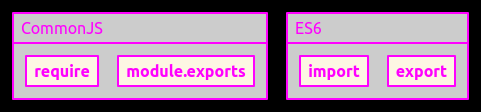

<h1 align="center">NodeJS for Newbie</h1>

- [JavaScript Server Side Technologies](https://en.wikipedia.org/wiki/List_of_server-side_JavaScript_implementations) 
- [Ryan Dahl and regret](https://www.youtube.com/watch?v=M3BM9TB-8yA)
- [General Info](https://exceptionshub.com/how-to-use-npm-with-node-exe.html)
- [NPM](https://github.com/npm/npm/releases)
- [NPM is bundled with Node](https://nodejs.org/en/download/)

- [NodeJS](#nodejs)
  - [NodeJS Command Line](#nodejs-command-line)
  - [NodeJS Specifications](#nodejs-specifications)
- [Arch Linux Error](#arch-linux-error)
- [Code](#code)
  - [NodeJS's Docs](#nodejss-docs)
  - [v14.13.0](#v14130)
  - [Global Objects](#global-objects)
  - [Callback or Promise?](#callback-or-promise)
  - [or Async/Await?](#or-asyncawait)
  - [Good Practice](#good-practice)
  - [Libs](#libs)
  - [Basics](#basics)
    - [Pass a function](#pass-a-function)
  - [Modules](#modules)
    - [Require vs Import](#require-vs-import)
  - [Files](#files)
  - [The Script World](#the-script-world)
    - [Parse JSON](#parse-json)
- [Vulnerabilities](#vulnerabilities)
  - [to check](#to-check)


## NodeJS

- built on top of the Google V8 JavaScript engine (since it was open-sourced under the BSD license)
  - Written in C++, V8 compiles JavaScript source code to native machine code at runtime
  - As of 2016, it also includes Ignition, a bytecode interpreter. 
- [**Event-driven programming**](https://en.wikipedia.org/wiki/Event-driven_programming)
  - callbacks to signal the completion of a task
- JavaScript is the only language that Node.js supports natively
  - many compile-to-JS languages are available.
    - CoffeeScript
    - Dart
    - TypeScript
    - ClojureScript
    - others

### NodeJS Command Line

Install dependencies specified in package.json
```
npm install
```

### NodeJS Specifications

- asynchronous programming
  - **asynchronous IO != asynchronous functions**
- single thread


```bash
node --version
```

- ECMAScript 6 (ES6), ECMAScript 2015
  - let
  - const
  - Arrow Functions
  - Classes
  - Default parameter values
  - Array.find()
  - Array.findIndex()
  - Exponentiation (**) (EcmaScript 2016)
- [dependencies, dev dependencies, peer dependencies](https://stackoverflow.com/questions/18875674/whats-the-difference-between-dependencies-devdependencies-and-peerdependencies)

>Within a package, the package.json "type" field defines how Node.js should interpret .js files.

>**If a package.json file does not have a "type" field, .js files are treated as CommonJS.**

> A package.json "type" value of "module" tells Node.js to interpret .js files within that package as using ES module syntax.

## Arch Linux Error
```
version `GLIBC_2.32' not found
```
I did a simple upgrade of glibc, actually I just upgraded all the system...
```bash
sudo pacman -Su
```
Not the cleanest solution xD

## Code

### [NodeJS's Docs](https://nodejs.org/en/docs/)
### [v14.13.0](https://nodejs.org/dist/latest-v14.x/docs/api/)
### [Global Objects](https://nodejs.org/dist/latest-v14.x/docs/api/globals.html)

### [Callback or Promise?](https://stackoverflow.com/questions/24275543/callback-or-promise)
### or [Async/Await?](https://www.youtube.com/watch?v=vn3tm0quoqE)

### Good Practice

```JavaScript 
function doSomething (callback) {
    // any async callback invokes callback with response
}

doSomething (function doSomethingAfter(err, result) {
    // process the async result
});
```
Example
```JavaScript
// the convention is not to throw
function divide4By (number, callback) {
  if(number == 0) 
    return callback(Error ('Cannot divide by zero'));
  else {
    number = 4/number;
    callback(null, number);
  }
}

// 2 -> number
// function(...) {...} -> callback
divide4By ( 2, function(err, result) {
  if (err) throw err; 
  console.log(result);
});
```

### Libs
- [Alternative libraries to request](https://github.com/request/request/issues/3143)

### Basics

#### Pass a function
```JavaScript
fs.readFile(path, (err, data) => {});

fs.readFile(path, function (err, data) {});
```

### Modules

#### [Require vs Import](https://stackoverflow.com/questions/46677752/the-difference-between-requirex-and-import-x)

<p>  </p>

- You can't selectively load only the pieces you need with require but with imports, you can selectively load only the pieces you need. That can save memory.
- Loading is synchronous(step by step) for require on the other hand import can be asynchronous(without waiting for previous import) so it can perform a little better than require.

### Files

var fs = require('fs');
- Read files
- Create files
- Update files
- Delete files
- Rename files
  
### The Script World

[Script like a monkey](https://nodejs.org/dist/latest-v14.x/docs/api/child_process.html)

- child_process.spawn()
- child_process.exec()
- child_process.fork()

#### Parse JSON

IF
```
[
    { 
        "site": "https://www.tomshardware.com/news" 
    },
    { 
        "site": "https://www.hwupgrade.it/" 
    },
    { 
        "site": "https://www.reddit.com/r/archlinux/" 
    }
]
    
```
THEN
```JavaScript
import fs from 'fs';
fs.readFile("links.json", function(err, data) { 
    if (err) throw err; 
    const links = JSON.parse(data); 
    links.forEach(l => {                // Look here
        console.log("link: " + l.site )
    });
});
```
IF
```
{
    "sites" : 
    [
        { 
            "site": "https://www.tomshardware.com/news" 
        },
        { 
            "site": "https://www.hwupgrade.it/" 
        },
        { 
            "site": "https://www.reddit.com/r/archlinux/" 
        }
    ]
}
```
THEN
```JavaScript
import fs from 'fs';
fs.readFile("links.json", function(err, data) { 
    if (err) throw err; 
    const links = JSON.parse(data); 
    links.sites.forEach(l => {          // Look here
        console.log("link: " + l.site )
    });
});
```

## Vulnerabilities

### to check

https://www.infoworld.com/article/3008837/nodejs-discloses-two-critical-security-vulnerabilities.html